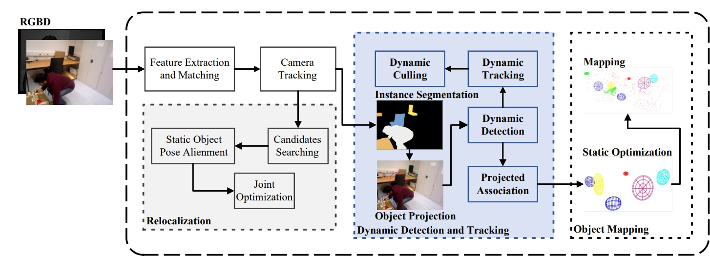
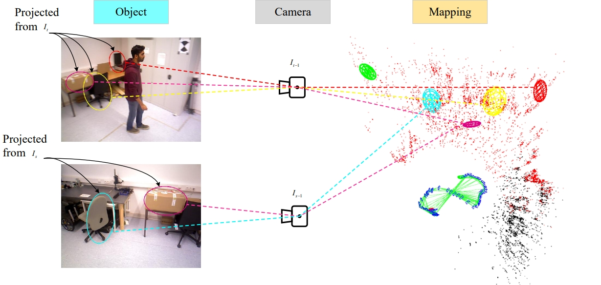
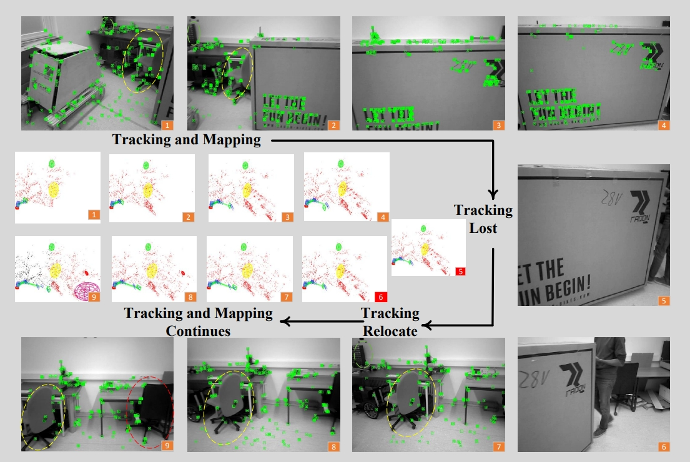

# DEllipsoid-SLAM
An Object-level SLAM Method Based on Ellipsoidal Representation in Dynamic Scenes.

  

video address:https://www.bilibili.com/video/BV1EV4y1D7GK/ 

Our environments: ubuntu18.04/GCC7.5/ GPU: RTX2080ti. 
Our sourse code: coming soon.

System critical step:

  

  

